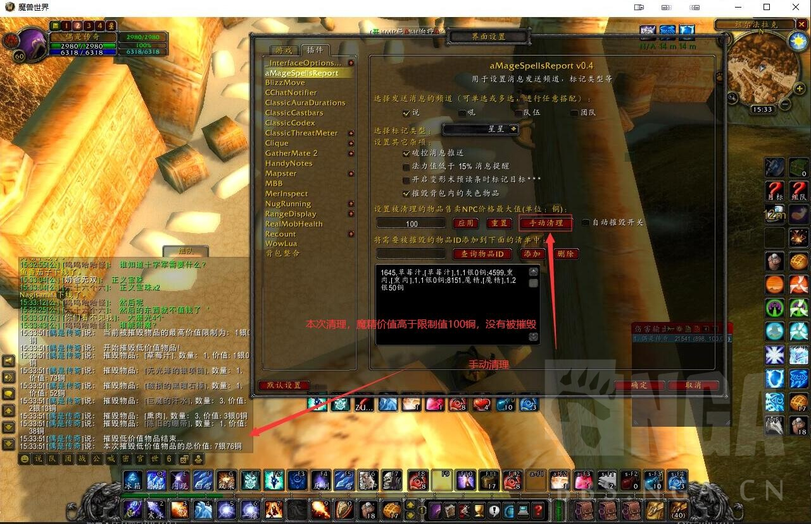

# aMageSpellsReport
WOW怀旧服：法师变形术、打断、破控消息通知，低法力提醒，一键或自动摧毁垃圾物品
## 主要功能：
1. 对被成功施放变形术的目标进行标记，并发送消息通知；若目标被标记，将保持原标记类型
2. 目标被打断施法成功后，发送消息通知
3. 战斗结束后，法力值低于15%提醒
4. 破控提醒
5. 手动点击按钮，清理低价值物品
6. 战斗结束后，自动清理低价值物品
7. 可自定义添加低价值物到待清理清单中
  >     插件依赖于战斗日志信息：`CombatLogGetCurrentEventInfo()`，所以：奥术飞弹类引到法术打断后没有消息提醒。

## 配置界面

## 功能演示

## 开发辅助
### 法术反制的战斗日志信息截图

### 变羊破控战斗日志消息截图
